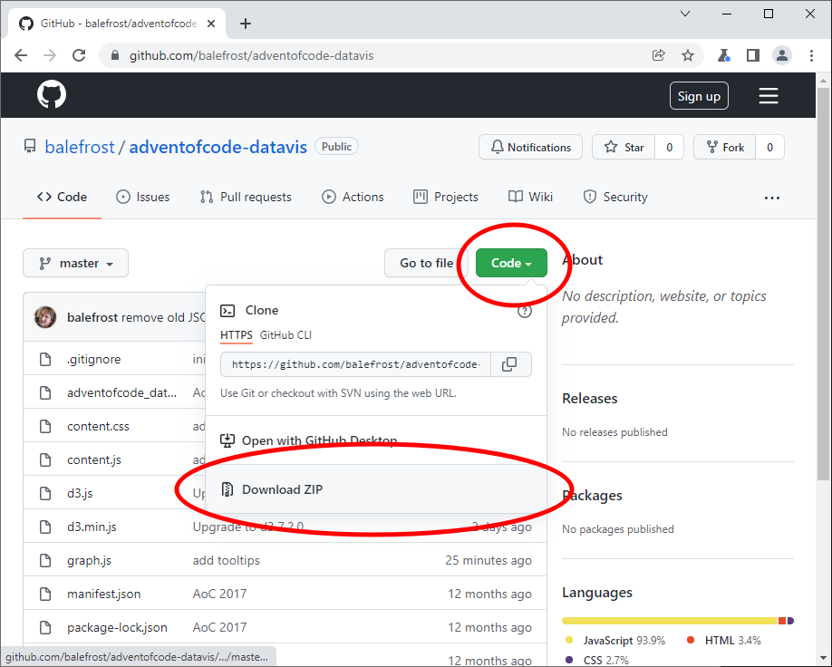
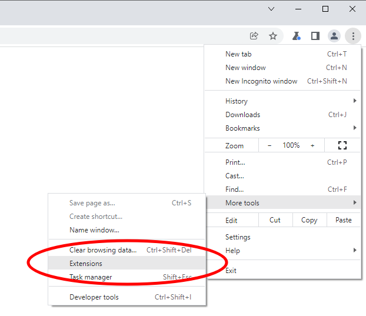
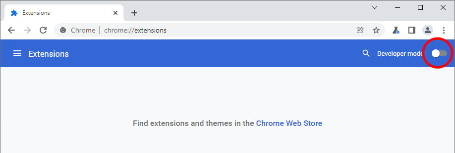
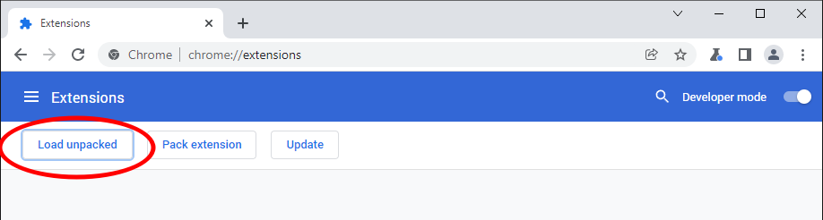
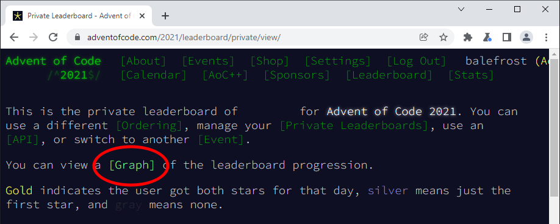

# Advent of Code Data Visualization

This is a terrible Chrome extension for graphing Advent of Code private leaderboard data. Seriously, you probably want to use the [Advent of Code Charts](https://github.com/jeroenheijmans/advent-of-code-charts) extension instead. ([Chrome Extension](https://chrome.google.com/webstore/detail/advent-of-code-charts/ipbomkmbokofodhhjpipflmdplipblbe)) ([Firefox Extension](https://addons.mozilla.org/en-US/firefox/addon/advent-of-code-charts/))

Still here? OK, here's how you can install this into Chrome:

## Sync the code from GitHub

## Open the Extensions list

## Enable Developer Mode

## Load the code as an unpacked extension

You want to pick the directory that contains the manifest.json file. In my case, I have a `C:\src\adventofcode-datavis\manifest.json`, so I pick `C:\src\adventofcode-datavis`. 

## Click the new "Graph" link in your private leaderboard's page

If you don't see the link, refresh the leaderboard page after installing the extension.

